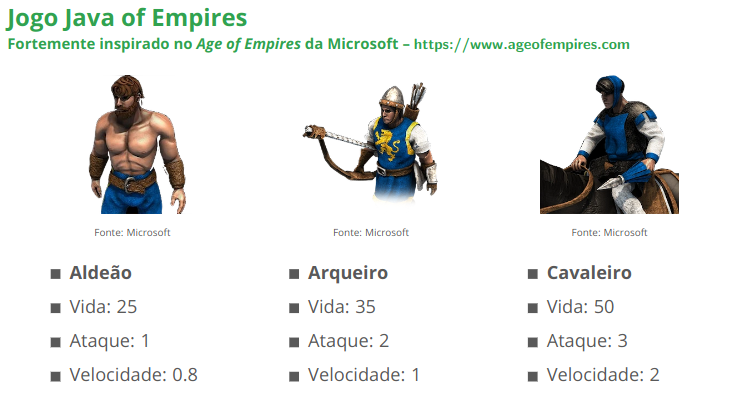

# Introdução a herança

## 1. Jogo Java of Empires

_Fortemente inspirado no Age of Empires da Microsoft – https://www.ageofempires.com_

### Herança de classes

- Modelagem UML
  - Todo personagem deve ser capaz de se mover e atacar, porém cada personagem se move e ataca de forma diferente
  - Basta retornar uma mensagem indicando o que o personagem está fazend
- Implementação em Java
  - Crie um aplicativo Java (classe com método main) e instancie objetos de cada classe
  - Invoque os métodos mover e atacar de cada objeto e imprima a mensagem retornada
---
## 2. Aplicativo para desenho vetorial 2D (geometria plana)

- Modelar classes para representar formas geométricas 2D
  - Linha
  - Circulo
  - Retângulo
- Cada forma deve possuir atributos que a caracterizam, como cor de linha,
cor de preenchimento, coordenadas, raio, etc.
- Cada forma deve possuir um método desenhar que irá retornar uma
String com os valores dos atributos do objeto, além de uma mensagem
indicando o tipo do objeto
- Formas geométricas que possuem área devem possuir métodos
calcularArea e calcularPerimetro
- Crie um aplicativo Java (classe com método main) e instancie objetos de
cada classe